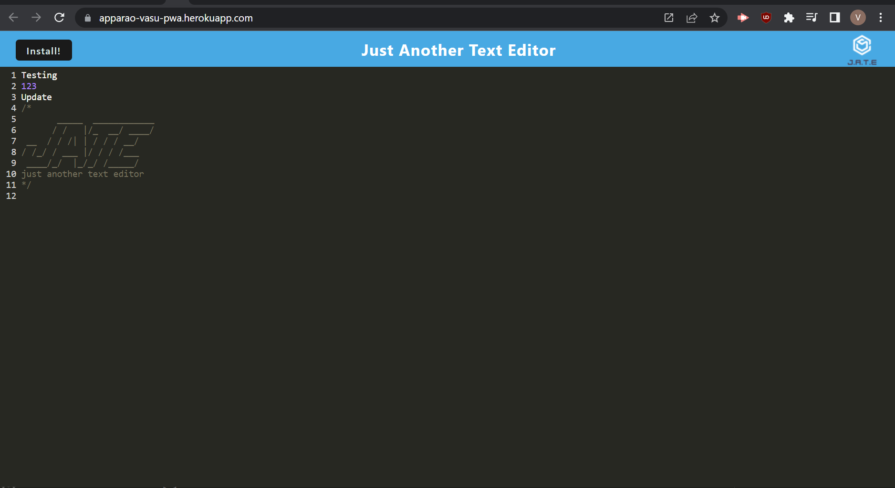

# PWA

## Deployable Link
https://apparao-vasu-pwa.herokuapp.com/

## Goal
The task was to build a text editor that runs in the browser using PWA web plugins and IndexedDB. The single-page application had to feature a number of data persistence techniques that serve as redundancy in case one of the options was not supported by the browser. The application also had to function offline.

## Technology Use
  - Javascript
  - PWA
  - Heroku
  - IndexedDB
  - VS Code
  - Git Bash 
  - GitHub

## Execution
Since starter code was given, the first step was to insert some webpack plugins into the webpack.config.js file. These included MiniCssExtractPlugin, InjectManifest, and WebpackPwaManifest which were necessary to make the application function. Each webpack needed a plugin as well in order for the application to function  as shown below:

MiniCssExtractPlugin code:
```Javascript
const MiniCssExtractPlugin = require('mini-css-extract-plugin');
```
```Javascript
new MiniCssExtractPlugin(),
```


InjectManifest code:
```Javascript
const { InjectManifest } = require('workbox-webpack-plugin');
```
```Javascript
new InjectManifest({
          swSrc: './src-sw.js',
          swDest: 'src-sw.js',
        }),
```

WebpackPwaManifest code:
```Javascript
const WebpackPwaManifest = require('webpack-pwa-manifest');
```
```Javascript
     new WebpackPwaManifest({
          fingerprints: false,
          inject: true,
          name: 'Jate',
          short_name: 'jate',
          description: 'Never forget Jate!',
          background_color: '#225ca3',
          theme_color: '#225ca3',
          start_url: './',
          publicPath: './',
          icons: [
            {
              src: path.resolve('src/images/logo.png'),
              sizes: [96, 128, 192, 256, 384, 512],
              destination: path.join('assets', 'icons'),
            },
          ],
        }),
```


After inputting the following webpacks into the webpack.config.js file the next step was a mix of commands like `npm run build`, `npm i`, and `npm start` in order to implement changes into the application. On top of these commands, there was a constant need to unregister service workers and delete local storage in order to make implementing the changes work. Failure to do so would make the changes mute. On top of that, code was needed in the srw-sw.js file

The following code in srw-sw.js is shown below:
```Javascript
const { offlineFallback, warmStrategyCache } = require('workbox-recipes');
const { CacheFirst, StaleWhileRevalidate } = require('workbox-strategies');
const { registerRoute } = require('workbox-routing');
const { CacheableResponsePlugin } = require('workbox-cacheable-response');
const { ExpirationPlugin } = require('workbox-expiration');
const { precacheAndRoute } = require('workbox-precaching/precacheAndRoute');

precacheAndRoute(self.__WB_MANIFEST);

const pageCache = new CacheFirst({
  cacheName: 'page-cache',
  plugins: [
    new CacheableResponsePlugin({
      statuses: [0, 200],
    }),
    new ExpirationPlugin({
      maxAgeSeconds: 30 * 24 * 60 * 60,
    }),
  ],
});

offlineFallback({
  pageFallback: '/index.html',
});

warmStrategyCache({
  urls: ['/index.html', '/'],
  strategy: pageCache,
});

registerRoute(({ request }) => request.mode === 'navigate', pageCache);


registerRoute(
   
   ({ request }) => ['style', 'script', 'worker'].includes(request.destination),
   new StaleWhileRevalidate({
     // Name of the cache storage.
     cacheName: 'asset-cache',
     plugins: [
   
       new CacheableResponsePlugin({
         statuses: [0, 200],
       }),
     ],
   })
);


```
Once all the codes were created, the installation process created files like main.bundle.js, install.bundle.js, and their subsequent license files within the dist folder. These newly generated files in the dist folder helped populate the user input into the code.

## Result

The following website demonstrates what the final product looks like:

